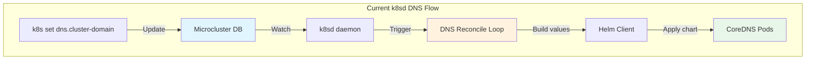
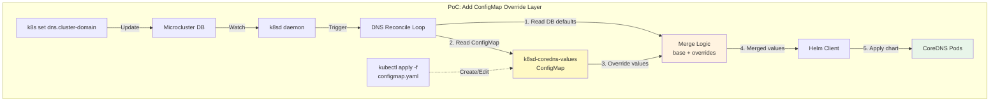
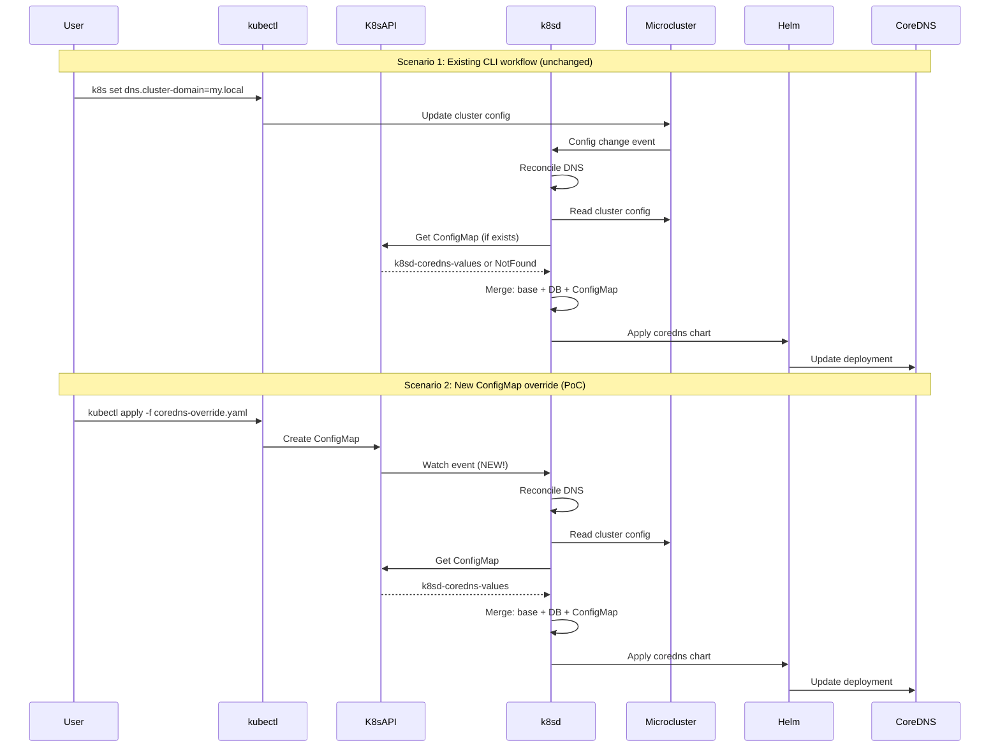
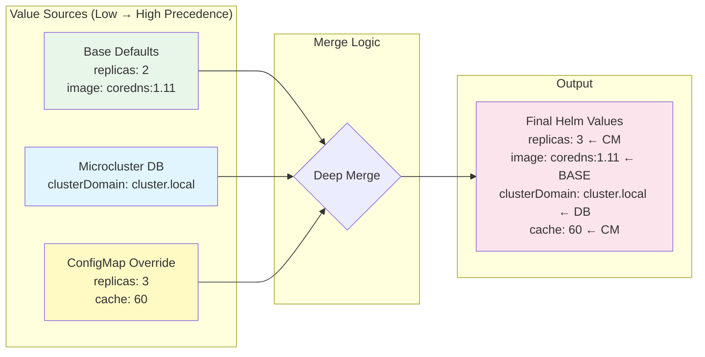

# CoreDNS ConfigMap PoC - Minimal Implementation Plan

**Status**: PoC Design  
**Timeline**: 2-3 days  
**Effort**: 1 developer  
**Risk**: LOW  
**Goal**: Prove ConfigMap-based helm value override works for CoreDNS feature

---

## Executive Summary

This PoC validates the core hypothesis: **ConfigMaps can override helm values for k8sd-managed features without requiring custom CRDs or microcluster changes.**

**Scope (MINIMAL):**
- ✅ Read `k8sd-coredns-values` ConfigMap if it exists
- ✅ Merge ConfigMap values with existing defaults
- ✅ Apply merged values to CoreDNS helm chart
- ❌ NO bootstrap file support (Day 2 only)
- ❌ NO validation webhook
- ❌ NO CLI commands (use kubectl directly)
- ❌ NO tests (manual validation only)

**Success Criteria:**
1. User creates ConfigMap → CoreDNS reconciles with new values
2. ConfigMap edit → CoreDNS updates automatically
3. ConfigMap delete → CoreDNS reverts to defaults
4. No disruption to existing CLI workflows (`k8s set dns.*`)

---

## Current Architecture (DNS Feature)



**Key Files (Reference):**
- `src/k8s/pkg/k8sd/features/dns/reconcile.go` - Reconcile logic
- `src/k8s/pkg/k8sd/types/cluster.go` - Cluster config types
- `src/k8s/cmd/k8s/set.go` - CLI command handlers

**Current Values Flow:**
```
1. User: k8s set dns.cluster-domain=my.local
2. CLI → Microcluster DB update
3. k8sd watches DB → triggers reconcile
4. reconcile() reads DB → builds helm values
5. helm.Apply("coredns", values) → pods restart
```

---

## Proposed Architecture (PoC)



**New Values Flow:**
```
1. User: kubectl apply -f coredns-override.yaml (optional)
2. k8sd watches ConfigMap → triggers reconcile
3. reconcile() reads:
   a. Microcluster DB (cluster-domain, etc.)
   b. k8sd-coredns-values ConfigMap (optional)
4. Merge: base ← DB config ← ConfigMap overrides
5. helm.Apply("coredns", mergedValues) → pods update
```

---

## Integration Points



---

## Data Flow: Merge Precedence



**Precedence Rule:**
```
ConfigMap > Microcluster DB > Base Defaults
```

**Example:**
```yaml
# Base defaults (hardcoded in reconcile.go)
replicas: 2
image: ghcr.io/canonical/coredns:1.11.1-ck4

# Microcluster DB (k8s set dns.*)
clusterDomain: cluster.local
upstreamNameservers: [8.8.8.8]

# ConfigMap (kubectl apply)
replicas: 3  # OVERRIDES base
cache: 60    # NEW value
prometheus:
  enabled: true

# Final merged values passed to helm:
replicas: 3             # ← ConfigMap
image: ghcr.io/...      # ← Base
clusterDomain: cluster.local  # ← DB
upstreamNameservers: [8.8.8.8]  # ← DB
cache: 60               # ← ConfigMap
prometheus:
  enabled: true         # ← ConfigMap
```

---

## Implementation Plan

### Phase 1: Read ConfigMap (30 minutes)

**File:** `src/k8s/pkg/k8sd/features/dns/reconcile.go`

**Changes:**
```go
// EXISTING: func reconcileDNS(ctx context.Context, snap snap.Snap, cfg types.ClusterConfig) error

// ADD: Read ConfigMap if it exists
func getConfigMapOverrides(ctx context.Context, snap snap.Snap) (map[string]any, error) {
    cm, err := snap.K8sClient().CoreV1().ConfigMaps("kube-system").Get(
        ctx, 
        "k8sd-coredns-values", 
        metav1.GetOptions{},
    )
    if err != nil {
        if apierrors.IsNotFound(err) {
            return nil, nil  // No ConfigMap = no overrides
        }
        return nil, fmt.Errorf("failed to get configmap: %w", err)
    }

    // Parse YAML from ConfigMap data["values"]
    overrides := make(map[string]any)
    if valuesYaml, ok := cm.Data["values"]; ok {
        if err := yaml.Unmarshal([]byte(valuesYaml), &overrides); err != nil {
            return nil, fmt.Errorf("failed to parse configmap values: %w", err)
        }
    }

    return overrides, nil
}
```

**Imports needed:**
```go
import (
    apierrors "k8s.io/apimachinery/pkg/api/errors"
    metav1 "k8s.io/apimachinery/pkg/apis/meta/v1"
    "gopkg.in/yaml.v3"
)
```

---

### Phase 2: Merge Logic (45 minutes)

**File:** `src/k8s/pkg/k8sd/features/dns/reconcile.go`

**Add merge function:**
```go
// mergeValues performs deep merge: base ← overlay
// overlay values take precedence over base
func mergeValues(base, overlay map[string]any) map[string]any {
    result := make(map[string]any)
    
    // Copy base
    for k, v := range base {
        result[k] = v
    }
    
    // Overlay values (recursive for nested maps)
    for k, v := range overlay {
        if baseVal, exists := result[k]; exists {
            // If both are maps, merge recursively
            if baseMap, ok := baseVal.(map[string]any); ok {
                if overlayMap, ok := v.(map[string]any); ok {
                    result[k] = mergeValues(baseMap, overlayMap)
                    continue
                }
            }
        }
        // Otherwise, overlay value takes precedence
        result[k] = v
    }
    
    return result
}
```

---

### Phase 3: Integration into Reconcile (30 minutes)

**File:** `src/k8s/pkg/k8sd/features/dns/reconcile.go`

**Modify existing reconcile function:**
```go
func reconcileDNS(ctx context.Context, snap snap.Snap, cfg types.ClusterConfig) error {
    // EXISTING: Build base helm values from cluster config
    helmValues := map[string]any{
        "replicas": 2,
        "image": map[string]string{
            "repository": "ghcr.io/canonical/coredns",
            "tag": "1.11.1-ck4",
        },
    }

    // EXISTING: Apply cluster config from microcluster DB
    if cfg.DNS.ClusterDomain != "" {
        helmValues["clusterDomain"] = cfg.DNS.ClusterDomain
    }
    if len(cfg.DNS.UpstreamNameservers) > 0 {
        helmValues["upstreamNameservers"] = cfg.DNS.UpstreamNameservers
    }

    // NEW: Read and merge ConfigMap overrides
    cmOverrides, err := getConfigMapOverrides(ctx, snap)
    if err != nil {
        return fmt.Errorf("failed to get configmap overrides: %w", err)
    }
    if cmOverrides != nil {
        helmValues = mergeValues(helmValues, cmOverrides)
    }

    // EXISTING: Apply helm chart
    return snap.HelmClient().Apply(ctx, "coredns", helmValues, /* ... */)
}
```

---

### Phase 4: Add ConfigMap Watcher (1 hour)

**File:** `src/k8s/pkg/k8sd/setup/features.go` (or wherever feature watchers are registered)

**Add watcher for ConfigMap changes:**
```go
// Watch for ConfigMap changes and trigger DNS reconcile
func watchDNSConfigMap(ctx context.Context, snap snap.Snap) {
    informer := snap.K8sClient().CoreV1().ConfigMaps("kube-system").Informer()
    
    informer.AddEventHandler(cache.ResourceEventHandlerFuncs{
        AddFunc: func(obj interface{}) {
            cm := obj.(*corev1.ConfigMap)
            if cm.Name == "k8sd-coredns-values" {
                triggerDNSReconcile(ctx, snap)
            }
        },
        UpdateFunc: func(old, new interface{}) {
            cm := new.(*corev1.ConfigMap)
            if cm.Name == "k8sd-coredns-values" {
                triggerDNSReconcile(ctx, snap)
            }
        },
        DeleteFunc: func(obj interface{}) {
            cm := obj.(*corev1.ConfigMap)
            if cm.Name == "k8sd-coredns-values" {
                triggerDNSReconcile(ctx, snap)
            }
        },
    })
}
```

**Note:** Exact integration depends on existing k8sd watcher infrastructure.

---

## Testing Plan (Manual)

### Test 1: ConfigMap Override Works

**Setup:**
```bash
# 1. Deploy cluster with default CoreDNS
sudo k8s bootstrap
sudo k8s status --wait-ready

# 2. Check baseline
sudo k8s kubectl get pods -n kube-system -l k8s-app=coredns
# Expected: 2 replicas (default)
```

**Create ConfigMap:**
```bash
cat <<EOF | sudo k8s kubectl apply -f -
apiVersion: v1
kind: ConfigMap
metadata:
  name: k8sd-coredns-values
  namespace: kube-system
data:
  values: |
    replicas: 3
    cache: 60
    prometheus:
      enabled: true
      port: 9153
EOF
```

**Validate:**
```bash
# Wait for reconcile (should be automatic via watcher)
sleep 10

# Check replicas updated
sudo k8s kubectl get deployment -n kube-system coredns -o jsonpath='{.spec.replicas}'
# Expected: 3

# Check helm values applied
sudo k8s kubectl get deployment -n kube-system coredns -o yaml | grep -A5 prometheus
# Expected: prometheus container with port 9153
```

**✅ Success Criteria:** Replicas changed from 2 → 3, prometheus enabled

---

### Test 2: ConfigMap Edit Triggers Reconcile

**Edit ConfigMap:**
```bash
sudo k8s kubectl edit configmap k8sd-coredns-values -n kube-system
# Change replicas: 3 → replicas: 4
```

**Validate:**
```bash
sleep 10
sudo k8s kubectl get deployment -n kube-system coredns -o jsonpath='{.spec.replicas}'
# Expected: 4
```

**✅ Success Criteria:** Replicas updated from 3 → 4 automatically

---

### Test 3: ConfigMap Delete Reverts to Defaults

**Delete ConfigMap:**
```bash
sudo k8s kubectl delete configmap k8sd-coredns-values -n kube-system
```

**Validate:**
```bash
sleep 10
sudo k8s kubectl get deployment -n kube-system coredns -o jsonpath='{.spec.replicas}'
# Expected: 2 (back to default)

sudo k8s kubectl get deployment -n kube-system coredns -o yaml | grep prometheus
# Expected: no prometheus section
```

**✅ Success Criteria:** CoreDNS reverted to base defaults

---

### Test 4: Existing CLI Still Works

**Use existing CLI:**
```bash
sudo k8s set dns.cluster-domain=my.local
```

**Validate:**
```bash
sudo k8s kubectl get deployment -n kube-system coredns -o yaml | grep clusterDomain
# Expected: clusterDomain: my.local
```

**Recreate ConfigMap with override:**
```bash
cat <<EOF | sudo k8s kubectl apply -f -
apiVersion: v1
kind: ConfigMap
metadata:
  name: k8sd-coredns-values
  namespace: kube-system
data:
  values: |
    replicas: 5
EOF
```

**Validate merge:**
```bash
sudo k8s kubectl get deployment -n kube-system coredns -o jsonpath='{.spec.replicas}'
# Expected: 5 (from ConfigMap)

sudo k8s kubectl get deployment -n kube-system coredns -o yaml | grep clusterDomain
# Expected: clusterDomain: my.local (from CLI, preserved)
```

**✅ Success Criteria:** CLI config (my.local) + ConfigMap override (replicas: 5) both applied

---

## Automated Validation Test

**Purpose:** This automated test enables agents to validate their implementation iteratively, ensuring high-quality output through rapid feedback loops.

**Location:** Create this script at `tests/poc/validate-coredns-configmap.sh`

### Test Script

```bash
#!/bin/bash
set -e

# Colors for output
RED='\033[0;31m'
GREEN='\033[0;32m'
YELLOW='\033[1;33m'
NC='\033[0m' # No Color

PASSED=0
FAILED=0
TOTAL=4

echo "=========================================="
echo "CoreDNS ConfigMap PoC Validation Test"
echo "=========================================="
echo ""

# Helper functions
pass() {
    echo -e "${GREEN}✓ PASS${NC}: $1"
    ((PASSED++))
}

fail() {
    echo -e "${RED}✗ FAIL${NC}: $1"
    echo -e "  ${YELLOW}Reason:${NC} $2"
    ((FAILED++))
}

info() {
    echo -e "${YELLOW}→${NC} $1"
}

cleanup() {
    info "Cleaning up test resources..."
    sudo k8s kubectl delete configmap k8sd-coredns-values -n kube-system --ignore-not-found=true 2>/dev/null || true
}

# Ensure cleanup on exit
trap cleanup EXIT

# Wait for pods to stabilize
wait_for_reconcile() {
    info "Waiting for reconcile (10s)..."
    sleep 10
}

# Get current replica count
get_replicas() {
    sudo k8s kubectl get deployment -n kube-system coredns -o jsonpath='{.spec.replicas}' 2>/dev/null || echo "0"
}

# Check if deployment has specific annotation/label/config
check_deployment_config() {
    local key=$1
    local expected=$2
    sudo k8s kubectl get deployment -n kube-system coredns -o yaml | grep -q "$key.*$expected"
}

echo ""
echo "Test 1: ConfigMap Override Works"
echo "-----------------------------------"

# Clean state
cleanup
wait_for_reconcile

# Get baseline
BASELINE_REPLICAS=$(get_replicas)
info "Baseline replicas: $BASELINE_REPLICAS"

if [ "$BASELINE_REPLICAS" != "2" ]; then
    fail "Test 1: Baseline replicas" "Expected 2, got $BASELINE_REPLICAS"
else
    # Create ConfigMap with overrides
    cat <<EOF | sudo k8s kubectl apply -f - >/dev/null 2>&1
apiVersion: v1
kind: ConfigMap
metadata:
  name: k8sd-coredns-values
  namespace: kube-system
data:
  values: |
    replicas: 3
EOF

    wait_for_reconcile
    
    # Check replicas updated
    NEW_REPLICAS=$(get_replicas)
    
    if [ "$NEW_REPLICAS" = "3" ]; then
        pass "Test 1: ConfigMap override works (replicas: 2 → 3)"
    else
        fail "Test 1: ConfigMap override works" "Expected replicas=3, got $NEW_REPLICAS"
    fi
fi

echo ""
echo "Test 2: ConfigMap Edit Triggers Reconcile"
echo "------------------------------------------"

# Edit ConfigMap (change replicas to 4)
sudo k8s kubectl patch configmap k8sd-coredns-values -n kube-system \
    --type merge -p '{"data":{"values":"replicas: 4\n"}}' >/dev/null 2>&1

wait_for_reconcile

UPDATED_REPLICAS=$(get_replicas)

if [ "$UPDATED_REPLICAS" = "4" ]; then
    pass "Test 2: Edit triggers reconcile (replicas: 3 → 4)"
else
    fail "Test 2: Edit triggers reconcile" "Expected replicas=4, got $UPDATED_REPLICAS"
fi

echo ""
echo "Test 3: ConfigMap Delete Reverts to Defaults"
echo "---------------------------------------------"

# Delete ConfigMap
sudo k8s kubectl delete configmap k8sd-coredns-values -n kube-system >/dev/null 2>&1

wait_for_reconcile

REVERTED_REPLICAS=$(get_replicas)

if [ "$REVERTED_REPLICAS" = "2" ]; then
    pass "Test 3: Delete reverts to defaults (replicas: 4 → 2)"
else
    fail "Test 3: Delete reverts to defaults" "Expected replicas=2, got $REVERTED_REPLICAS"
fi

echo ""
echo "Test 4: Existing CLI Still Works"
echo "---------------------------------"

# Use existing CLI to set cluster-domain
sudo k8s set dns.cluster-domain=poc-test.local >/dev/null 2>&1

wait_for_reconcile

# Check cluster domain was applied
if sudo k8s kubectl get configmap coredns -n kube-system -o yaml | grep -q "poc-test.local"; then
    # Now add ConfigMap override
    cat <<EOF | sudo k8s kubectl apply -f - >/dev/null 2>&1
apiVersion: v1
kind: ConfigMap
metadata:
  name: k8sd-coredns-values
  namespace: kube-system
data:
  values: |
    replicas: 5
EOF

    wait_for_reconcile
    
    # Check both CLI config and ConfigMap override are applied
    MERGE_REPLICAS=$(get_replicas)
    CLI_PRESERVED=$(sudo k8s kubectl get configmap coredns -n kube-system -o yaml | grep -c "poc-test.local" || echo "0")
    
    if [ "$MERGE_REPLICAS" = "5" ] && [ "$CLI_PRESERVED" != "0" ]; then
        pass "Test 4: CLI + ConfigMap merge works (cluster-domain + replicas)"
    else
        fail "Test 4: CLI + ConfigMap merge" "replicas=$MERGE_REPLICAS (expected 5), cluster-domain found=$CLI_PRESERVED (expected >0)"
    fi
else
    fail "Test 4: CLI config" "Cluster domain 'poc-test.local' not found in CoreDNS config"
fi

# Reset cluster-domain to default
sudo k8s set dns.cluster-domain=cluster.local >/dev/null 2>&1

echo ""
echo "=========================================="
echo "Test Summary"
echo "=========================================="
echo -e "Total:  $TOTAL tests"
echo -e "${GREEN}Passed: $PASSED${NC}"
echo -e "${RED}Failed: $FAILED${NC}"
echo ""

if [ $FAILED -eq 0 ]; then
    echo -e "${GREEN}✓ ALL TESTS PASSED${NC}"
    echo "The ConfigMap PoC implementation is working correctly."
    exit 0
else
    echo -e "${RED}✗ SOME TESTS FAILED${NC}"
    echo "Review the implementation and fix the failing tests."
    exit 1
fi
```

### Running the Test

**Prerequisites:**
```bash
# Ensure cluster is running
sudo k8s status

# Make script executable
chmod +x tests/poc/validate-coredns-configmap.sh
```

**Execute:**
```bash
sudo tests/poc/validate-coredns-configmap.sh
```

**Expected Output (Success):**
```
==========================================
CoreDNS ConfigMap PoC Validation Test
==========================================

Test 1: ConfigMap Override Works
-----------------------------------
→ Baseline replicas: 2
→ Waiting for reconcile (10s)...
✓ PASS: Test 1: ConfigMap override works (replicas: 2 → 3)

Test 2: ConfigMap Edit Triggers Reconcile
------------------------------------------
→ Waiting for reconcile (10s)...
✓ PASS: Test 2: Edit triggers reconcile (replicas: 3 → 4)

Test 3: ConfigMap Delete Reverts to Defaults
---------------------------------------------
→ Waiting for reconcile (10s)...
✓ PASS: Test 3: Delete reverts to defaults (replicas: 4 → 2)

Test 4: Existing CLI Still Works
---------------------------------
→ Waiting for reconcile (10s)...
→ Waiting for reconcile (10s)...
✓ PASS: Test 4: CLI + ConfigMap merge works (cluster-domain + replicas)

==========================================
Test Summary
==========================================
Total:  4 tests
Passed: 4
Failed: 0

✓ ALL TESTS PASSED
The ConfigMap PoC implementation is working correctly.
```

**Expected Output (Failure Example):**
```
==========================================
CoreDNS ConfigMap PoC Validation Test
==========================================

Test 1: ConfigMap Override Works
-----------------------------------
→ Baseline replicas: 2
→ Waiting for reconcile (10s)...
✗ FAIL: Test 1: ConfigMap override works
  Reason: Expected replicas=3, got 2

Test 2: ConfigMap Edit Triggers Reconcile
------------------------------------------
→ Waiting for reconcile (10s)...
✗ FAIL: Test 2: Edit triggers reconcile
  Reason: Expected replicas=4, got 2

...

==========================================
Test Summary
==========================================
Total:  4 tests
Passed: 1
Failed: 3

✗ SOME TESTS FAILED
Review the implementation and fix the failing tests.
```

### Integration into Development Workflow

**Iterative Development Loop:**
```bash
# 1. Make code changes to reconcile.go
vim src/k8s/pkg/k8sd/features/dns/reconcile.go

# 2. Build k8s-snap
make build

# 3. Restart k8sd to load changes
sudo systemctl restart snap.k8s.k8sd

# 4. Run validation test
sudo tests/poc/validate-coredns-configmap.sh

# 5. If failures, go back to step 1
```

**CI Integration (Future):**
```bash
# Add to .github/workflows/poc-tests.yaml
- name: Validate CoreDNS ConfigMap PoC
  run: sudo tests/poc/validate-coredns-configmap.sh
```

### Test Coverage

This automated test validates:
- ✅ ConfigMap reading works (Test 1)
- ✅ Merge precedence correct (Test 1)
- ✅ Watcher triggers reconcile (Test 2)
- ✅ Delete reverts to defaults (Test 3)
- ✅ Existing CLI preserved (Test 4)
- ✅ Merge with CLI config (Test 4)

**Not covered (manual verification needed):**
- ❌ Invalid YAML handling (error logs)
- ❌ Large ConfigMap (>1MB) rejection
- ❌ Performance under load
- ❌ Concurrent ConfigMap edits

### Debugging Failed Tests

**Test 1 fails (ConfigMap not read):**
```bash
# Check if ConfigMap was created
sudo k8s kubectl get configmap k8sd-coredns-values -n kube-system

# Check k8sd logs for errors
sudo journalctl -u snap.k8s.k8sd -f | grep -i coredns

# Verify getConfigMapOverrides() is being called
# Add debug log: log.Info("Reading ConfigMap overrides...")
```

**Test 2 fails (watcher not triggering):**
```bash
# Check if watcher is registered
sudo journalctl -u snap.k8s.k8sd | grep -i "watch\|informer"

# Manually trigger reconcile
sudo systemctl restart snap.k8s.k8sd

# Check if reconcile runs after restart
sudo tests/poc/validate-coredns-configmap.sh
```

**Test 3 fails (not reverting to defaults):**
```bash
# Check if ConfigMap delete event is received
sudo journalctl -u snap.k8s.k8sd -f

# Then delete ConfigMap and watch logs
sudo k8s kubectl delete configmap k8sd-coredns-values -n kube-system

# Verify mergeValues() handles nil override correctly
```

**Test 4 fails (CLI config lost):**
```bash
# Check merge precedence order
# Verify: base ← DB ← ConfigMap (not: ConfigMap ← DB ← base)

# Verify cluster config is read before ConfigMap
# Add debug logs in reconcile function
```

---

## Example ConfigMap

```yaml
apiVersion: v1
kind: ConfigMap
metadata:
  name: k8sd-coredns-values
  namespace: kube-system
data:
  values: |
    # Override replicas
    replicas: 3
    
    # Add prometheus metrics
    prometheus:
      enabled: true
      port: 9153
    
    # Custom cache settings
    cache: 60
    
    # Resource limits
    resources:
      limits:
        cpu: 200m
        memory: 256Mi
      requests:
        cpu: 100m
        memory: 128Mi
    
    # Custom plugins (advanced)
    corefile: |
      .:53 {
          errors
          health {
              lameduck 5s
          }
          ready
          kubernetes cluster.local in-addr.arpa ip6.arpa {
              pods insecure
              fallthrough in-addr.arpa ip6.arpa
              ttl 30
          }
          prometheus :9153
          forward . /etc/resolv.conf {
              max_concurrent 1000
          }
          cache 60
          loop
          reload
          loadbalance
      }
```

---

## Edge Cases & Limitations

### Edge Case 1: Invalid YAML in ConfigMap

**Scenario:** User creates ConfigMap with invalid YAML
```yaml
data:
  values: |
    replicas: [this is not valid
```

**Behavior:** 
- `getConfigMapOverrides()` returns error
- DNS reconcile fails, logs error
- CoreDNS continues with last known good config

**Future Enhancement:** Admission webhook to validate before apply

---

### Edge Case 2: ConfigMap Overrides Blacklisted Value

**Scenario:** User tries to override image:
```yaml
data:
  values: |
    image:
      repository: malicious.io/evil-coredns
```

**PoC Behavior:** ❌ Not validated - security risk!

**Future Enhancement:** Add validation to reject:
- `image.*` (security)
- `nodeSelector.kubernetes.io/hostname` (availability)
- `hostNetwork: true` (security)

**Temporary Mitigation:** Document that image overrides are unsafe, rely on RBAC

---

### Edge Case 3: Conflicting ConfigMap and CLI Config

**Scenario:**
```bash
# CLI sets cluster-domain
sudo k8s set dns.cluster-domain=prod.local

# ConfigMap also sets it
values: |
  clusterDomain: dev.local
```

**Behavior:** ConfigMap wins (highest precedence)

**Trade-off:** This is by design - ConfigMap is "power user" mode

---

### Edge Case 4: Large ConfigMap (>1MB)

**Scenario:** User puts 2MB of values in ConfigMap

**Behavior:** 
- Kubernetes allows ConfigMaps up to 1MB
- Apply will fail with `ConfigMap too large` error
- CoreDNS continues with last known good config

**Mitigation:** Document size limit, suggest splitting large configs

---

## Success Metrics

| Metric | Target | Validation |
|--------|--------|------------|
| ConfigMap read works | ✅ | Test 1 passes |
| Merge precedence correct | ✅ | ConfigMap > DB > Base |
| Watcher triggers reconcile | ✅ | Test 2 passes (edit triggers update) |
| Delete reverts to defaults | ✅ | Test 3 passes |
| Existing CLI unaffected | ✅ | Test 4 passes |
| Manual testing duration | < 30 minutes | All 4 tests |

---

## Out of Scope (PoC)

These are explicitly NOT included in the PoC to keep it minimal:

- ❌ Bootstrap file support (`coredns-values-file:` in bootstrap.yaml)
- ❌ Validation webhook (admission control)
- ❌ CLI commands (`k8s validate dns`, `k8s show values dns`)
- ❌ Automated tests (unit, integration, e2e)
- ❌ Security blacklist enforcement
- ❌ Multi-feature support (only DNS, not cilium/ingress/etc)
- ❌ Documentation (this doc is the only artifact)
- ❌ RBAC examples
- ❌ GitOps examples

**Rationale:** PoC validates the core technical approach. These features are Phase 2+.

---

## Risks & Mitigation

| Risk | Severity | Probability | Mitigation |
|------|----------|-------------|------------|
| Merge logic breaks existing config | HIGH | LOW | Manual test 4 validates CLI preserved |
| Watcher doesn't trigger reconcile | HIGH | MEDIUM | Add debug logs, test with kubectl edit |
| Invalid YAML crashes k8sd | MEDIUM | MEDIUM | Wrap parse in error handling |
| ConfigMap overrides dangerous values | HIGH | LOW | Document limits, future validation |

---

## Next Steps After PoC

If PoC succeeds (4/4 tests pass):

1. **Phase 1: MVP** (from IMPLEMENTATION-PLAN.md)
   - Add bootstrap file support
   - Add validation (blacklist)
   - Add unit tests
   - Apply to Cilium feature

2. **Phase 2: Tooling**
   - CLI commands (validate, show)
   - Admission webhook

3. **Phase 3: Multi-Feature**
   - Extract common utilities
   - Apply to all features

4. **Phase 4: Production**
   - Documentation
   - GitOps examples
   - User acceptance testing

If PoC fails:
- Document blockers
- Reassess approach
- Consider alternatives (ADR amendment)

---

## Architecture Decision Linkage

This PoC validates the technical feasibility of:
- **ADR-003**: ConfigMap approach over CRD approach
- **SPEC-003**: ConfigMap-based feature configuration
- **FINAL-RECOMMENDATION.md**: 87% confidence validated through hands-on proof

**Key Hypothesis Being Tested:**
> "k8sd can read ConfigMaps, merge with existing config, and apply to helm charts without disrupting existing workflows or requiring CRD infrastructure."

---

## Document Status

**Status**: Ready for Implementation  
**Last Updated**: 2026-06-10  
**Author**: Architecture Team  
**Reviewer**: Engineering Lead  
**Target Start**: Next Sprint

---

## Appendix: File Changes Summary

| File | Lines Changed | Type |
|------|---------------|------|
| `src/k8s/pkg/k8sd/features/dns/reconcile.go` | +80 | Feature logic |
| `src/k8s/pkg/k8sd/setup/features.go` | +25 | Watcher setup |
| **Total** | **~105 lines** | **2 files** |

**Estimated Implementation Time**: 2-3 hours (plus 30 min manual testing)
