# etcd downgrade safety — problem, solution, gaps (visual companion)

Companion to [003-etcd-native-downgrade.md](003-etcd-native-downgrade.md), for team
discussion. Diagrams are mermaid (render on GitHub).

**TL;DR** — 1.37 ships etcd 3.7; a node downgraded to 1.36 gets an etcd 3.6 binary
that **panics at startup** against the 3.7 cluster version, and no offline tool can
fix it. We prepare the downgrade **before** snapd swaps binaries, using etcd's own
official downgrade flow, driven from the snap `pre-refresh` hook. No data loss.
Gaps: `snap revert` stays unsupported, simultaneous all-node refreshes can strand a
member (recoverable), and the fix must ship in the **source** track (1.37).

---

## 1. The problem

### 1.1 What happens today on a downgrade

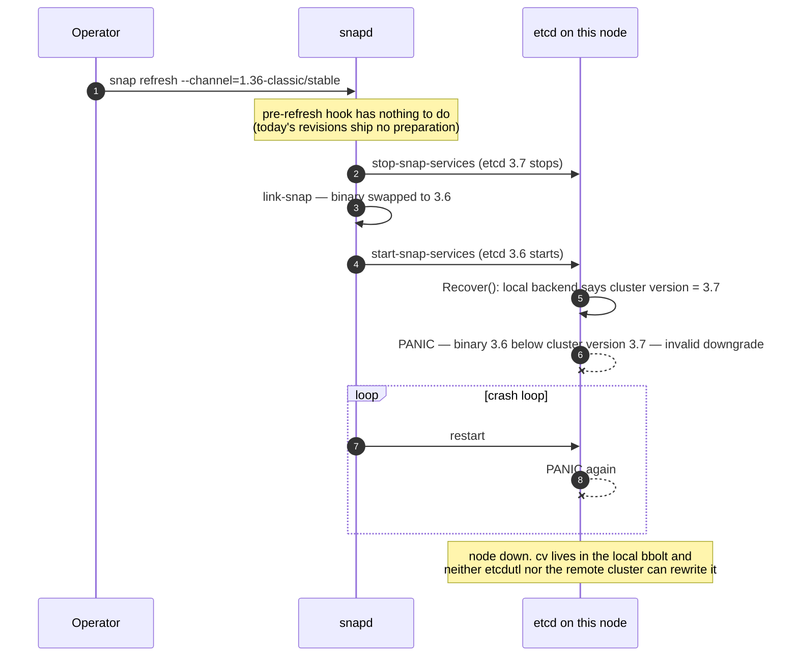

### 1.2 The startup gate (why it panics)

Every etcd start reads the **local backend's** persisted cluster version and compares
it to the binary version — before raft catch-up, so a stale local value is fatal even
if the rest of the cluster has moved on:

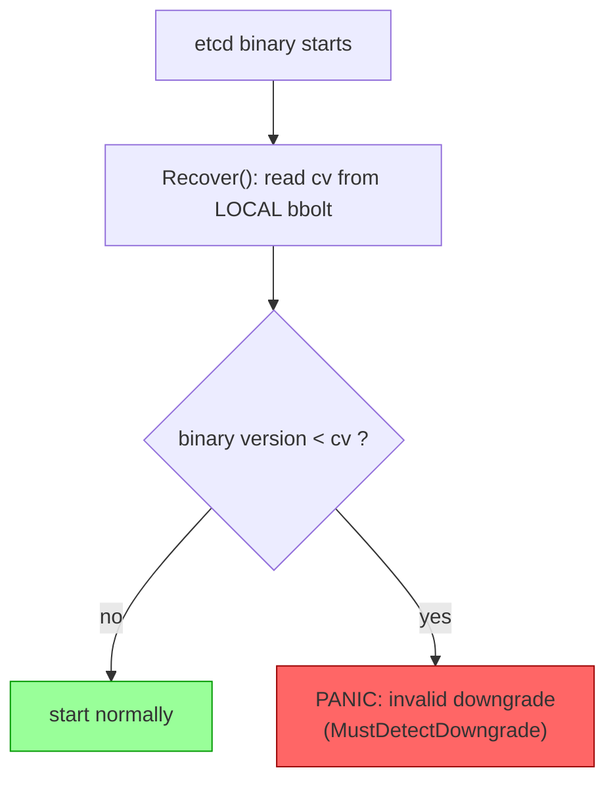

Key facts:

- cv moves to 3.7 once **all** members run 3.7 (raft consensus).
- cv is applied to each member's **local** backend only while that member is **running**.
- `etcdutl` can rewrite the *storage* version but has **no** cluster-version writer.
- The 3.6↔3.7 storage schema is identical — cv is the only gate that matters here.

---

## 2. The solution: prepare before the swap

snapd's refresh chain gives us exactly one window where the old etcd is still serving
and the refresh can still be aborted:

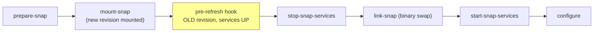

We hook that window. `pre-refresh` calls a new hidden k8sd command,
`k8s x-etcd prepare-downgrade`, which automates etcd's
[official downgrade procedure](https://etcd.io/docs/v3.7/downgrades/downgrade_3_7/):

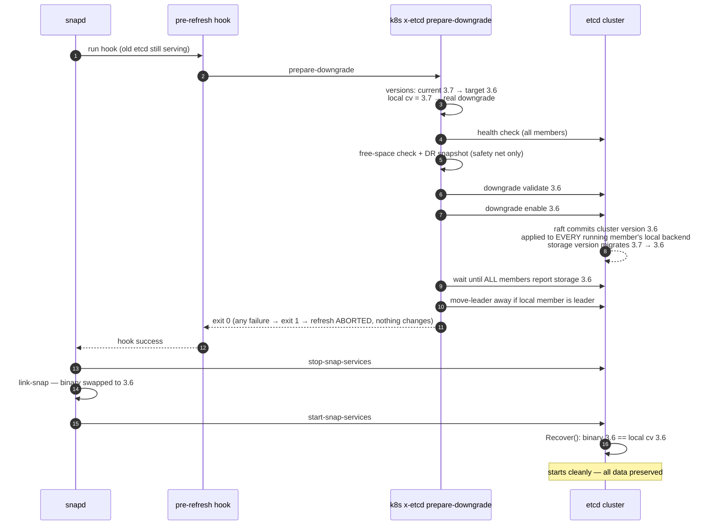

Because the enable commits **while this node's etcd is still a running raft member**,
its local backend carries cv=3.6 into the swap — the panic gate passes. When the last
node in the cluster lands on 3.6, etcd auto-completes the downgrade.

### 2.1 Decision logic (handles the tricky cases)

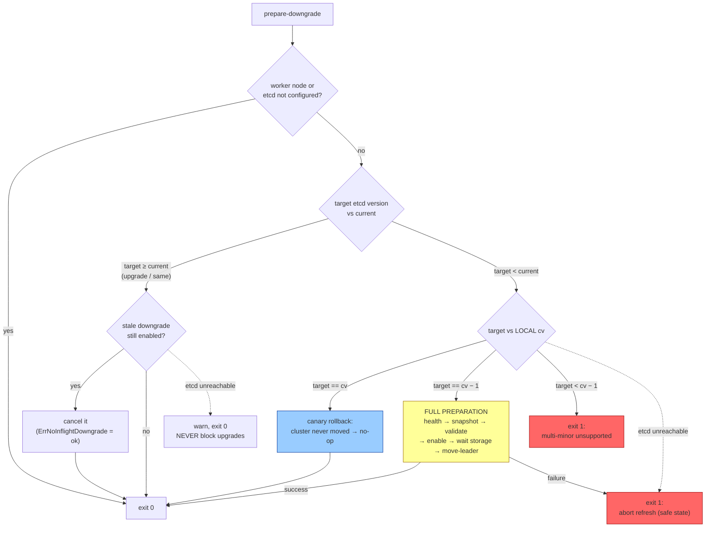

Two cases worth calling out:

- **Canary rollback** (upgrade 1 of 3 nodes, roll it back): cv never left 3.6, so no
  preparation is needed at all — the no-op path. An earlier draft of this design
  *blocked* this scenario; the matrix fixes it.
- **cv is read from the LOCAL member's `/version`**, not from any peer: the panic
  keys off the local backend, and a lagging member can disagree with the cluster
  during transitions.

### 2.2 HA rolling downgrade (the tested path)

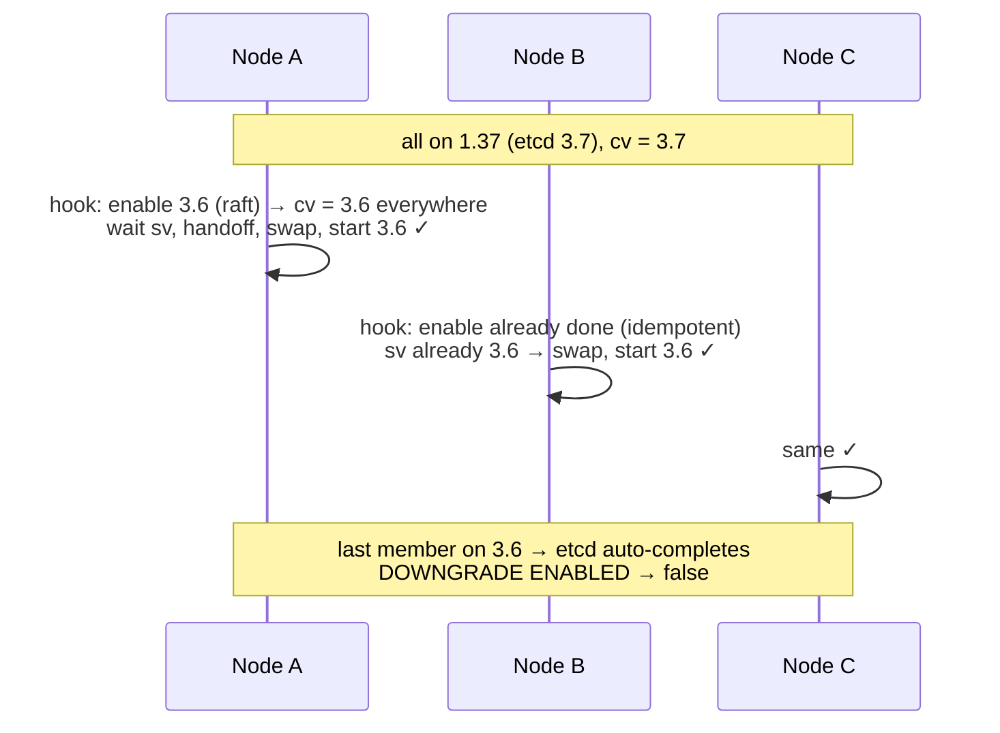

Concurrent hooks converge: the enable is an idempotent raft write, and a second node
simply observes "already in process" and resumes at the wait step.

---

## 3. The gaps (to discuss)

### 3.1 `snap revert` cannot be fixed

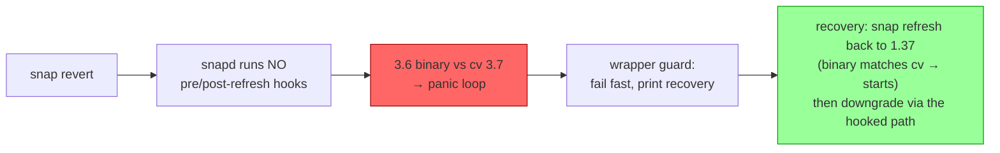

`snap revert` across an etcd minor boundary is **documented as unsupported**;
`snap refresh --channel=<lower track>` is the supported downgrade path (and what CI
exercises). The wrapper guard turns an opaque panic loop into an actionable message.

### 3.2 The strandable member (simultaneous refreshes)

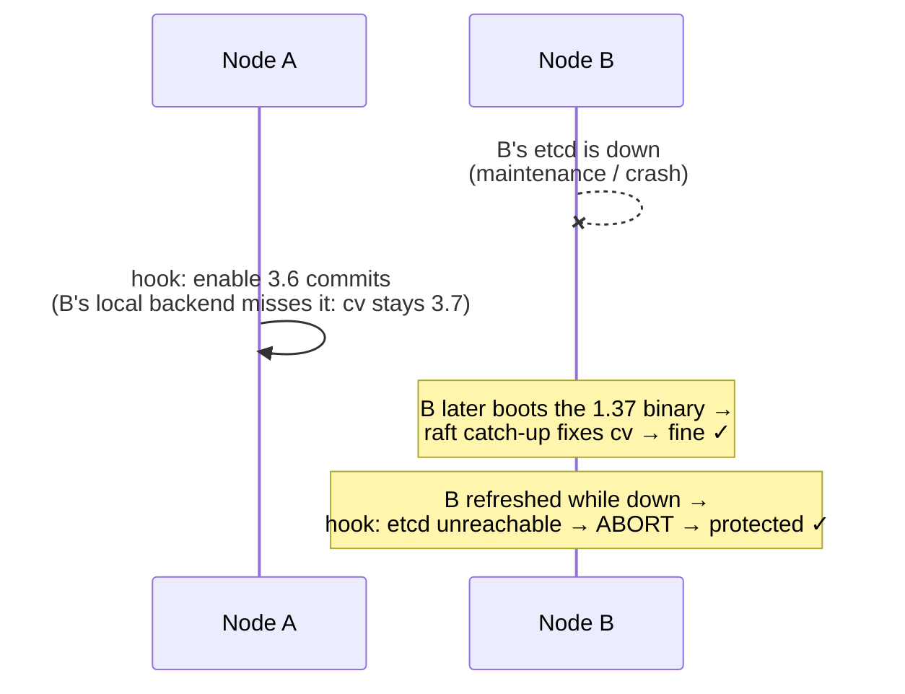

Protection comes from **ordering + local state**, not new coordination state:

- a node's hook always runs *before* its own etcd stops, so its local backend always
  has cv moved before the swap;
- a node whose etcd is unreachable at hook time gets its refresh **aborted** (safe);
- worst case, the node is always revivable: re-refresh to the newer track (binary
  matches cv → starts → catch up → retry downgrade).

Residual risk: pathological simultaneous-refresh interleavings on unhealthy clusters
can still strand a member → rolling refreshes are the documented procedure.

### 3.3 The aborted upgrade (auto-revert)

The most likely *real-world* way to hit the panic — not an intentional downgrade,
but snapd undoing a **failed upgrade** to 1.37:

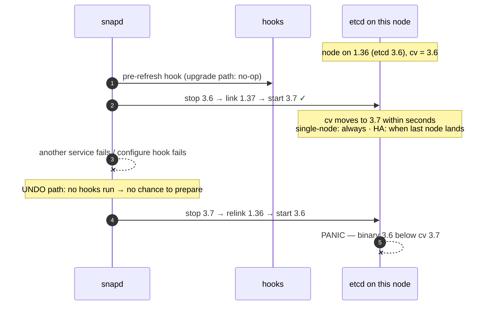

Whether it bites depends on **cv timing** when the abort hits:

| Situation at abort time | cv | Reverted 3.6 binary |
|---|---|---|
| single-node cluster | 3.7 (moves seconds after 3.7 starts) | **panic — stranded** |
| HA, first/middle node upgraded | 3.6 (peers still on 3.6) | starts fine — lucky |
| HA, last node upgraded | 3.7 (its start completed the set) | **panic — stranded** |

Mitigation — **arm-before-fail**: when the abort is triggered by *our own*
`configure` hook (e.g. a k8sd health gate), that hook arms the downgrade before
exiting non-zero:

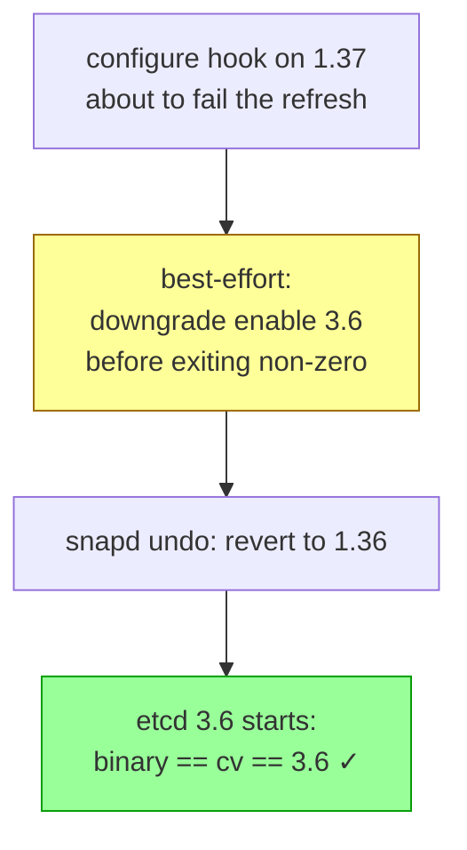

Honest limit: if the trigger is **another service failing at start-snap-services**,
the chain unwinds before `configure` ever runs — arm-before-fail gets no chance.
That sub-case falls back to the wrapper guard + always-working recovery:

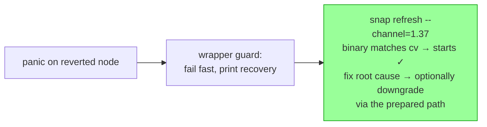

### 3.4 Gap & mitigation summary

| Gap | Severity | Mitigation |
|-----|----------|------------|
| `snap revert` across boundary | unsupported path | wrapper guard + documented recovery (refresh-based) |
| **Aborted 1.37 upgrade → auto-revert** | **likely real-world trigger** | arm-before-fail (hook-triggered aborts); wrapper guard + re-upgrade recovery (service-start aborts) |
| Simultaneous all-node refresh | residual | docs: roll nodes; recovery always possible via re-upgrade |
| Fix must ship in the **source** track | rollout constraint | backport to `release-1.37` **required**; release notes list min source revision |
| Downgrades to pre-fix revisions | permanent | documented minimum revisions |
| One etcd minor per step | upstream limit | multi-track downgrades go track by track |
| 3.7 features off between enable and last swap | upstream semantics | documented; window is minutes |
| Unhealthy cluster blocks downgrade | by design | hook aborts refresh; cluster stays on current revision |
| DR snapshot disk usage (≤3× DB) | ops | free-space pre-check; rotation |
| 10-min snapd hook timeout | constraint | 8-min internal budget; bounded waits |
| Strict confinement readability (PKI, sibling revs) | open | PoC verification item before strict ships |
| `snap change` parsing (fallback discovery) | fragility | fail-safe abort, never wrong action |

### 3.5 Explicitly not building (for now)

- **Cross-node refresh coordination** (e.g. `gate-auto-refresh` + `snapctl refresh
  --hold`, or Upgrade CR sequencing) — possible future enhancement; only gates
  *auto*-refreshes anyway.
- **A parallel state store** for the downgrade — etcd's own raft-replicated
  `DowngradeInfo` + cluster version is the single source of truth; we only add a
  per-node audit log for observability/tests.
- **Offline repair of a stranded member** — impossible without data loss (no tool
  can rewrite local cv); re-upgrade is the repair.

---

## 4. Rollout

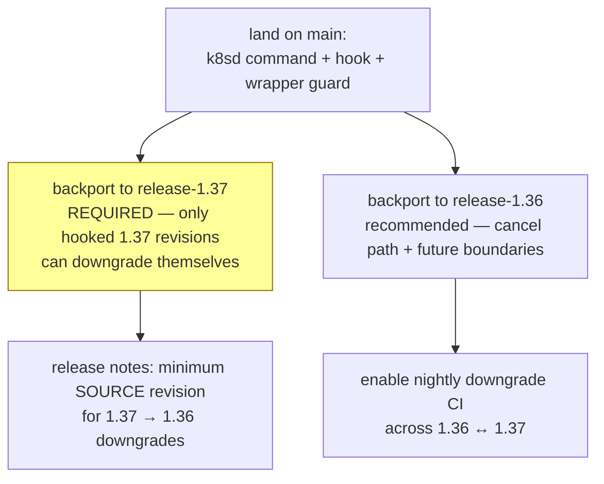

## 5. Questions for the team

1. Are we comfortable documenting `snap revert` as unsupported across etcd minor
   boundaries (channel downgrade as the only supported path)?
2. Rolling-only refreshes as the documented HA procedure — acceptable, or do we want
   the `gate-auto-refresh` hold mechanism investigated now?
3. DR snapshot policy: hard requirement (abort downgrade if it can't be taken) or
   best-effort with a loud warning?
4. Strict flavor: who can run the confinement PoC (PKI + sibling-revision readability
   from hook context)?
5. Backport scope: 1.37 only, or 1.36 as well in the same round?
